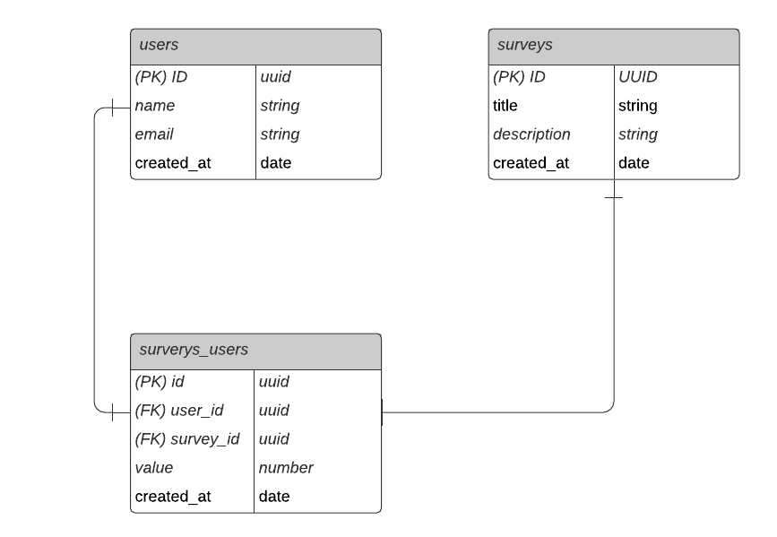

<h1 align="center">NPS-NLW</h1>

<p align="center">
  <a href="#-technologies">Technologies</a>&nbsp;&nbsp;&nbsp;|&nbsp;&nbsp;&nbsp;
  <a href="#-project">Project</a>&nbsp;&nbsp;&nbsp;|&nbsp;&nbsp;&nbsp;
  <a href="#-diagram">Diagram</a>&nbsp;&nbsp;&nbsp;|&nbsp;&nbsp;&nbsp;
  <a href="#-how-to-run">How to run</a>
</p>

<p align="center">
 
</p>

<br>

## ✨ Technologies

This project was developed with the following technologies:

- [TypeScript](https://www.typescriptlang.org/)
- [Ethereal-Email](https://ethereal.email/)
- [TypeORM](https://typeorm.io/#/)
- [Express](https://expressjs.com/pt-br/)
- [Jest](https://jestjs.io/)
- [SQL Editor Beekeeper Studio](https://www.beekeeperstudio.io/)

## 💻 Project

This is an application that consists of calculating a Company's NPS (Net Promoter Score).
The NPS objective is to assess customer satisfaction, asking “from 0 to 10, how much would you recommend our company to friends?”.
The formula for calculating NPS is: % promoting customers (grades 9 and 10) - % detrimental customers (grades 0 to 6) = NPS

The application registrates users, surveys and send e-mail for users to respond the satisfaction surveys and with the chosen value is possible to calculate the NPS.

This project was developed during the the fourth edition of NLW (Next Level Week) from RocketSeat. 
Concepts learned: 
- What is an API
- How to start a project using Typescript and Express for route management
- TypeORM for data manipulation
- Automated tests with Jest
- Sending e-mail with Ethereal

## 🔶 Diagram



## 🚀 How to run

```
# Clone this repository
$ https://github.com/laise-tanaka/nlw-04-nodejs.git

# Install dependencies
$ npm install

# Start the project
$ npm run dev

# Test the project
$ npm run test
```

The application can be accessed at [`localhost:3000`](http://localhost:3000).

---
